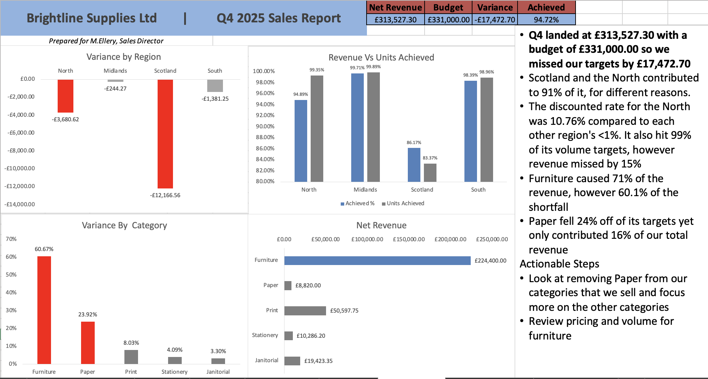
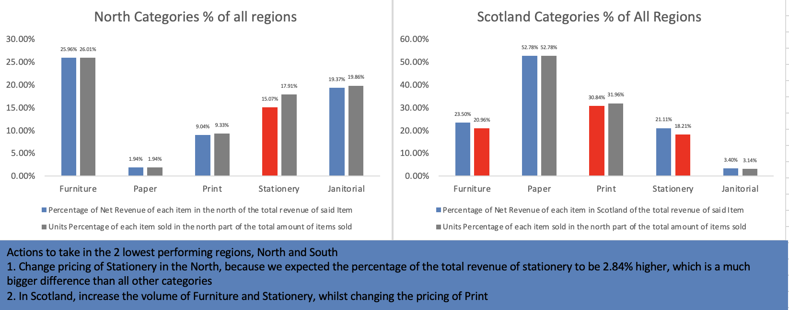

# Brightline Supplies Ltd — Q4 Sales Performance Analysis
## The problem
Q4 revenue came in under budget. The Sales Director could not explain why.
I was given a raw ERP export and asked which region underperformed, which
category drives revenue and whether the shortfall was volume or pricing.
## The data
187 rows of order-level sales data, plus a budget file and an approved
discount list. Excel only.
## Cleaning
- Removed 7 duplicate orders
- Standardised 16 spellings of 4 regions using TRIM and PROPER
- Converted units, prices and dates from text to usable types
- Excluded 12 orders with no quantity, documented in the workbook
- Joined an approved discount list with INDEX and MATCH to get net revenue
## Findings
- Q4 net revenue GBP 304,559 against a GBP 331,000 plan, a GBP 26,442 miss
- Scotland and the North caused 91% of the shortfall
- Scotland: volume. 83% of its unit plan
- The North: pricing. 99% of its unit plan, 85% of revenue, 10.8% discount
rate against under 1% elsewhere
- Furniture is 71% of revenue and 69% of the shortfall
## Recommendation
Review discount authority in the North and pipeline in Scotland. Add the
discount field to the ERP export so net revenue exists at source.
Change pricing of Stationery in the North, because we expected the percentage of the total revenue of stationery to be 2.84% higher, which is a much bigger difference than all other categories 
In Scotland, increase the volume of Furniture and Stationery, whilst changing the pricing of Print.
## Dashboard

## Tools
Excel: Xlookup, SUMIFS, PivotTables, conditional formatting, charting
